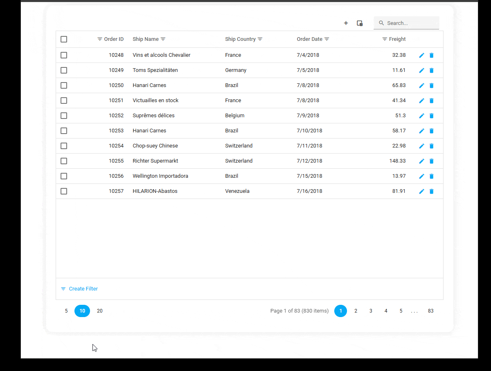

<!-- default badges list -->

<!-- default badges end -->
# DevExtreme - Switch Between DataGrid and CardView

This example switches between DataGrid and CardView based on screen width.

## Implementation Details
- Toggle [DataGrid.visible](https://js.devexpress.com/Documentation/ApiReference/UI_Components/dxDataGrid/Configuration/#visible) and [CardView.visible](https://js.devexpress.com/Documentation/ApiReference/UI_Components/dxCardView/Configuration/#visible) simultaneously to switch between components.
- Implement the same [data store](https://js.devexpress.com/Documentation/Guide/Data_Binding/Data_Layer/#Creating_DataSource/What_Are_Stores) for both components to share data. To update data, call the store's [push](https://js.devexpress.com/Documentation/Guide/Data_Binding/Data_Layer/#Data_Modification/Integration_with_Push_Services) method using [DataGrid.onSaved](https://js.devexpress.com/Documentation/ApiReference/UI_Components/dxDataGrid/Configuration/#onSaved) and [CardView.onSaved](https://js.devexpress.com/Documentation/ApiReference/UI_Components/dxCardView/Configuration/#onSaved) event handlers.
- To synchronize component states/settings (such as selection, applied filters, and pagination settings):
    - In `jQuery` and `ASP.NET Core`, configure [onOptionChanged](https://js.devexpress.com/Documentation/ApiReference/UI_Components/dxDataGrid/Configuration/#onOptionChanged) to track changes in required properties. Call the [option](https://js.devexpress.com/Documentation/ApiReference/UI_Components/dxDataGrid/Methods/#optionoptionName_optionValue) method to apply changes to another component.
    - In `Angular` and `Vue`, implement [Two-Way Property Binding](https://js.devexpress.com/Documentation/Guide/Angular_Components/Component_Configuration_Syntax/#Two-Way_Property_Binding).
    - In `React`, use [Controlled Mode](https://js.devexpress.com/React/Documentation/Guide/React_Components/State_Management/#Controlled_Mode).

## Files to Review

- **Angular**
    - [app.component.html](Angular/src/app/app.component.html)
    - [app.component.ts](Angular/src/app/app.component.ts)
- **React**
    - [App.tsx](React/src/App.tsx)
- **Vue**
    - [HomeContent.vue](Vue/src/components/HomeContent.vue)
- **jQuery**
    - [index.html](jQuery/src/index.html)
    - [index.js](jQuery/src/index.js)
    - [SyncHelper.js](jQuery/src/SyncHelper.js)
- **ASP.NET Core**    
    - [Index.cshtml](ASP.NET%20Core/Views/Home/Index.cshtml)
    - [SyncHelper.js](ASP.NET%20Core/wwwroot/js/SyncHelper.js)

## Documentation

- [Getting Started with DataGrid](https://js.devexpress.com/Documentation/Guide/UI_Components/DataGrid/Getting_Started_with_DataGrid/)
- [Getting Started with CardView](https://js.devexpress.com/jQuery/Documentation/Guide/UI_Components/CardView/Getting_Started_with_CardView/)

<!-- feedback -->
## Does this example address your development requirements/objectives?

 

(you will be redirected to DevExpress.com to submit your response)
<!-- feedback end -->
